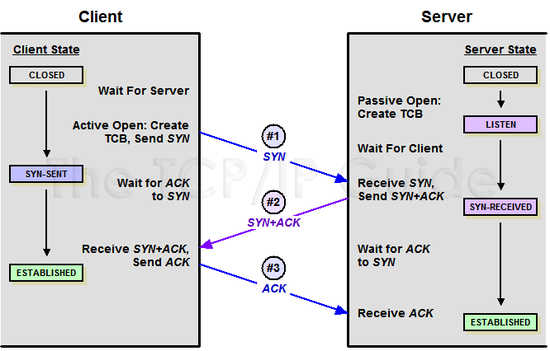

# TCP

## 3 way handshake

- TPC통신을 이용하여 데이터 전송하기 위한 네트워크 연결을 설정하는 과정
- 양측 모두 데이터를 전송할 준비가 되어있다는 것을 보장하고, 실제로 데이터 전달이 시작하기 전 한 쪽이 다른 쪽이 준비가 되었다는 것을 알 수 있도록 해야한다.
- 전송하기 전 정확한 전송을 보장하기 위해 상대방 컴퓨터와 사전에 세션을 수립하는 과정

1. 통신을 하기 위해 **A가 B에게** 연결 확립을 해달라고 요청(SYN 비트 1)
    
    
    
2. B는 A 가 보낸 요청을 받은 후 연결 확립에 대한 응답(ACK)과 B도 A에게 데이터 전송에 대한 허가를 받기 위해 연결을 확립해달라고 요청(SYN)보냄 (B가 A에게)
    
    
    
3. A는 B의 요청을 받았으니 연결 확립에 대한 응답(Ack)를 보냄
    
    
    

URG : Urgent

ACK : Acknowledgement

PSH : Push

RST : Reset

SYN : Synchronize

FIN : Finish

---

## 4 way handshake

- 연결을 종료할 때 과정 - TCP는 연결을 종료할 때도 확인 과정을 거침
- 세션 연결 확립 후 종료하기 위해 패킷 요청을 4번 교환함

1. A는 B에게 연결 종료(FIN)를 요청
    
    
    
2. B는 A에게 연결 종료에 대한 응답(ack) 반환
    
    
    
3. B도 A에게 연결 종료 요청fin보냄
    
    
    
4. A가 B에게 연결 종료에 대한 응답(ack)반환
    
    
    

## TCP 제어 기능

TCP는 크게 3가지 제어 기능이 있음

1. 전송되는 데이터의 양을 조절하는 **흐름제어**
2. 데이터의 유실이나 잘못된 데이터가 수신되었을 경우 대처하는 **오류제어**
3. 네트워크 혼잡에 대처하는 **혼잡제어**

### 흐름제어

송신측과 수신측의 데이터 처리 속도 차이에서 발생하는 문제를 해결하기 위함

1. stop and wait : 
    1. 상대방에게 데이터를 보낸 후 잘 받았다는 응답이 올 때 까지 기다리는 방식
    2. 비효율적
    
    
    
2. Sliding Window
    1. 상대방에게 응답을 받지 않아도 범위 내에서 데이터를 보낼 수 있음
    2. 통신 과정 중에도 네트워크 환경에 따라 윈도우 크기는 유동적을 설정됨
        
        
        
        
        

### **혼잡제어**

네트워크 혼잡에 대처하는 제어기법

1. AIMD(Additive Increase / Multiplicative Decrease)
    1. 처음에 패킷을 한 개씩 보내고 문제없이 도착하면 패킷의 수를 증가시켜가며 전송하는 방법
    2. 패킷 전송에 실패하거나 일정 시간을 넘으면 패킷의 보내는 속도를 절반으로 줄임
    3. 공평한 방식
        1. 시간이 흐르면 평형상태로 수렴
    4. 단점
        1. 속도를 올리는데 오래걸림
        2. 네트워크가 혼잡해지는 상황을 미리 감지하지 못함 > 혼잡해지고 조절
2. Slow Start (느린 시작)
    1. 패킷을 하나씩 보내면서 시작, 패킷이 문제없이 도착하면 각각의 ACK 패킷마다 윈도우 크기를 1씩 늘림
    2. AIMD보다 속도 증가 폭이 큼
    3. 혼잡이 감지되면 윈도우 크기 1로 만듦
    4. 한번 혼잡 현상이 발생하고 나면 네트워크의 수용량을 예상 가능
    5. 그 후 혼잡 현상이 발생하였던 윈도우 크기의 절반까지는 이전처럼 지수 함수 꼴로 크기를 증가시키고 그 이후부터는 완만하게 1씩 증가시킴
3. Fast Retransmit (빠른 재전송)
    1. 수신측에서 데이터를 받을 때 마다 다음에 받아야 할 패킷을 응답함(ACK)
    2. 먼저 도착해야 할 패킷이 도착하기 전 다음 패킷이 도착하였을 경우 받아야할 ACK패킷을 다시 보냄
    3. 수신측에선 중복된 패킷을 받게 되면 문제가 된 패킷을 다시 재전송 할 수 있음
        
        
        
4. Fast Recovery (빠른 회복)
    1. 혼잡한 상태가 되면 윈도우 크기를 절반으로 줄이고 이후 AIMD 방식처럼 선형증가시키는 방법

출처)

[https://www.youtube.com/watch?v=gPsSLwaFhYo](https://www.youtube.com/watch?v=gPsSLwaFhYo)

